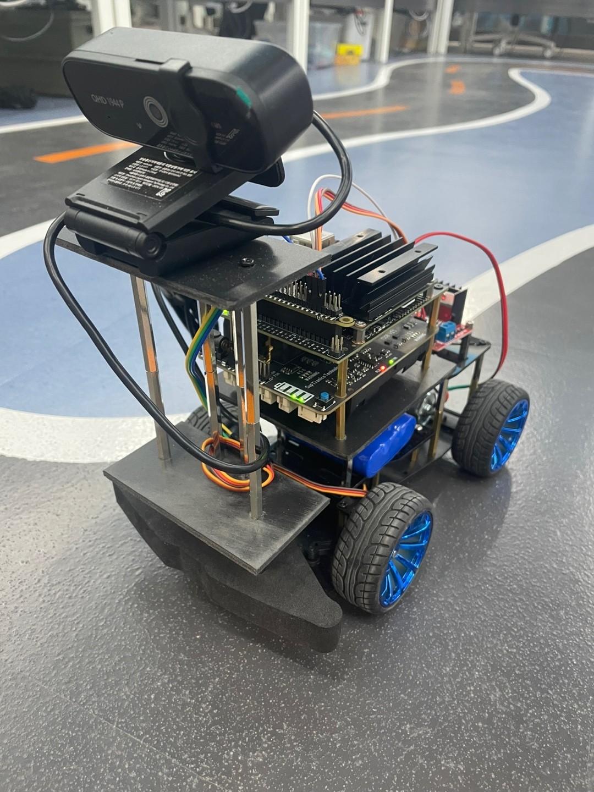
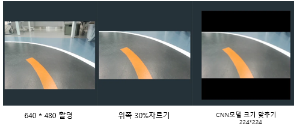
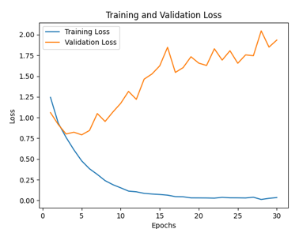
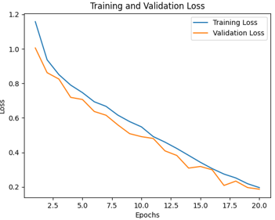
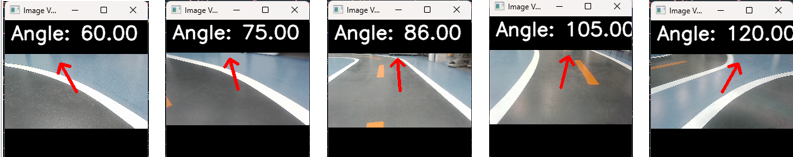

このプロジェクトの README は日本語と韓国語で提供いたします。  
이 프로젝트의 README는 한국어와 일본어로 제공됩니다.

- [日本語 (Japanese)](README_jp.md)
- [한국어 (Korean)](README.md)

# 🚗 ミニ自律走行車プロジェクト

Jetson Nanoを基盤としてライン追跡型の自律走行車を制作したプロジェクトです。カメラで車線を認識し、DCモーターとサーボモーターを制御することで、トラックの中央をスムーズに走行するように実装しました。

---

## 📌 プロジェクト概要

### 🎯 目標
- カメラ入力による車線認識  
- リアルタイムな角度・速度制御  
- Jetson Nanoとモータードライバを活用した自律走行車の開発

### ❗ 問題定義
- 不正確な車線検出  
- 角度と速度の調整の難しさ  
- リアルタイム処理の遅延

---

## ⚙ 技術スタック

### 🔩 ハードウェア
| 構成要素           | 説明 |
|--------------------|------|
| Jetson Nano        | NVIDIA AI基盤のエンベデッドコンピュータ |
| UPSモジュール      | 電源安定化 |
| ウェブカメラ       | リアルタイム映像入力 |
| サーボモーター (MG996R)  | 方向制御 |
| DCモーター (12V)      | 速度制御 |
| バッテリーパック (11.1V) | 電源供給 |
| モータードライバ (L298N) | モーター制御および電源供給 |

### 💻 ソフトウェア
| 技術        | バージョン           |
|-------------|----------------------|
| Python      | 3.6.9                |
| OpenCV      | 4.1.1                |
| Numpy       | 1.16.6               |
| PyTorch     | 1.10.0 (CUDA対応)    |
| TorchVision | 0.11.0a0+5eae32      |
| JetPack     | 4.6.1                |
| Jetson.GPIO | 2.0.17               |

---

## 🧱 システム構成

### 🚘 車両構造
- カメラは上部に傾けて設置（広い視野確保）  
- 角度制御：サーボモーター（0°～180°）  
- 速度制御：DCモーター（前進／後退制御）

📷 実車写真  


### 📸 データ収集
- OpenCVでリアルタイムフレーム撮影  
- 各角度ごとにフォルダを分けて画像保存  
- 初期：ボタンベースの撮影 → 最終：フレーム単位の自動撮影

### ⚙ 前処理
- 画像サイズ：640×480 → 上部30%を切り取り、224×224にリサイズ  
- テンソル変換：`ToTensor()` により (C, H, W) 形式へ  
- 正規化：`Normalize(mean, std)` を使用（範囲：-0.5 ~ 0.5）

🖼 前処理例  


---

## 🧠 ディープラーニングモデル

### ✅ CNN構造
```text
Input → Conv → ReLU → Pooling → (反復) → FC → Output（角度予測）
```

### 🧪 学習条件
- **Epochs**: 30  
- **Batch Size**: 32  
- **Learning Rate**: 0.001  
- **データセット分割**: 学習用 70% / 検証用 30%  
- **総画像数**: 約5,710枚  
  - トラックを一方向に走行しながら収集したため、左折・直進データの比率が高い  
- **過学習問題の発生**  
  - 初期は特定の方向に偏ったデータにより学習の偏りが発生  
  - `Normalize(mean, std)` の範囲を **[-0.5, 0.5]** に再調整して解決

| 📊 初期学習結果（過学習） | 📊 前処理後の再学習結果 |
|-------------------------|-----------------------|
|  |  |


---

## 🧪 性能テストおよび最適化

- **モデル性能の検証**  
  - Jetson Nanoにモデルをデプロイする前にPC上で検証  
  - 予測された角度を画像上に矢印として可視化し、精度を確認

- **Jetson Nano 実環境でのテスト**  
  - トラック上に車両を配置し、実際の走行を通してモデル性能を確認  
  - 停止中の状態でも予測値のモニタリングが可能

- **並列処理の導入**  
  - `Thread` を使用して「撮影スレッド」と「車両制御スレッド」を分離  
  - タスク間の待機時間を最小化し、リアルタイム性を確保

📊 車線角度ごとにモデルが予測した結果を可視化した画像  


---

## 💡 プロジェクト中の課題とその解決策

| 課題内容                             | 解決策 |
|--------------------------------------|--------|
| 機材の配送遅延・Jetsonの不具合       | スケジュールを調整し、予備機材を確保 |
| 撮影方法が非効率だった               | ボタン操作から自動フレーム撮影に変更 |
| 過学習の発生                         | 正規化範囲の再設定・データセットの再構成 |
| 環境構築の困難（ライブラリの競合）   | CUDAの互換バージョン明記、仮想環境の使用 |
| ハードウェア電流知識の不足           | 外部の回路学習資料を活用し実践を並行 |

---

## 🚀 今後の改善方向

- **障害物検知と回避機能の追加**  
- **信号機や道路標識の認識**  
- **屋外環境での車線検出機能の強化**  
- **光・影・天候など環境変化への耐性を持つモデル設計**

---

